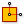

.. index:: PlaneToPolyline (GH)

.. _planetopolyline_gh:

PlaneToPolyline |icon| 
-----------------------

Creates a 2-segmented Polyline from a Plane. First Segment represents the X-Axis, the second represents Y.

